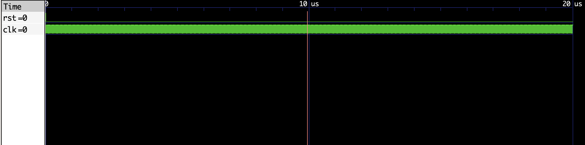

# BCD Counter to Seven-Segment Decoder VHDL Implementation

This repository contains VHDL code for a BCD counter (`bcd_counter_seven_segment`) driving a seven-segment display, along with its corresponding testbench (`bcd_counter_seven_segment_tb`). The BCD counter counts from 0 to 9999 and displays the count on a seven-segment display.

## Files

- `bcd_counter_seven_segment.vhdl`: VHDL code for the BCD counter entity and architecture.
- `bcd_counter_seven_segment_tb.vhdl`: VHDL code for the testbench entity and architecture.

## `bcd_counter_seven_segment` Entity

The `bcd_counter_seven_segment` entity represents a BCD counter driving a seven-segment display with the following ports:

- `clk`: Clock signal input.
- `rst`: Reset signal input.
- `seven_segment_out`: Output signal representing the segments to display on the seven-segment display.

## Behavior

The BCD counter increments on each rising edge of the clock (`clk`). When the count reaches 9999, it rolls over to 0000. The BCD output is converted to the appropriate seven-segment display segments for each digit.

## Testbench (`bcd_counter_seven_segment_tb`)

The testbench (`bcd_counter_seven_segment_tb`) is used to verify the functionality of the `bcd_counter_seven_segment` entity. It provides clock and reset signals to the counter and observes the output signals.

## Running the Testbench

To run the testbench:

1. Compile the VHDL files (`bcd_counter_seven_segment.vhdl` and `bcd_counter_seven_segment_tb.vhdl`) using a VHDL compiler (e.g., GHDL).
2. Simulate the compiled design using a simulator (e.g., GHDL or ModelSim).

## Observing Output

The testbench monitors the output signal `seven_segment_out`, which represents the segments to display on the seven-segment display.

## Screenshot

