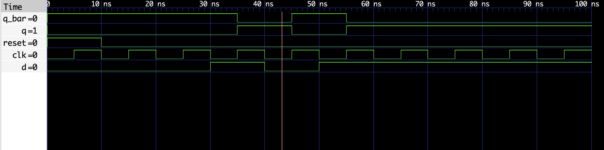

# D Flip-Flop VHDL Implementation

This repository contains VHDL code for a D flip-flop (`d_flipflop`) and its corresponding testbench (`d_flipflop_tb`). The D flip-flop captures the value of the input (`D`) on the rising edge of the clock (`CLK`) and retains it until the next rising edge. It also features an asynchronous reset (`RESET`) input.

## Files

- `d_flipflop.vhdl`: VHDL code for the D flip-flop entity and architecture.
- `d_flipflop_tb.vhdl`: VHDL code for the testbench entity and architecture.
- `d.png`: Screenshot photo showing simulation results.

## `d_flipflop` Entity

The `d_flipflop` entity represents a D flip-flop with the following ports:

- `D`: Data input.
- `CLK`: Clock input.
- `RESET`: Asynchronous reset input.
- `Q`: Output representing the captured value of `D`.
- `Q_bar`: Complementary output of `Q`.

## Behavior

The D flip-flop captures the value of input `D` on the rising edge of the clock (`CLK`). If the reset (`RESET`) signal is asserted (`'1'`), the flip-flop is asynchronously reset to `'0'`.

## Testbench (`d_flipflop_tb`)

The testbench (`d_flipflop_tb`) verifies the functionality of the `d_flipflop` entity. It provides stimulus to the flip-flop inputs (`D`, `CLK`, `RESET`) and monitors the outputs (`Q`, `Q_bar`).

## Running the Testbench

To run the testbench:

1. Compile the VHDL files (`d_flipflop.vhdl` and `d_flipflop_tb.vhdl`) using a VHDL compiler (e.g., GHDL).
2. Simulate the compiled design using a simulator (e.g., GHDL or ModelSim).

## Observing Output

The testbench monitors the outputs `Q` and `Q_bar` to ensure correct behavior of the D flip-flop.

