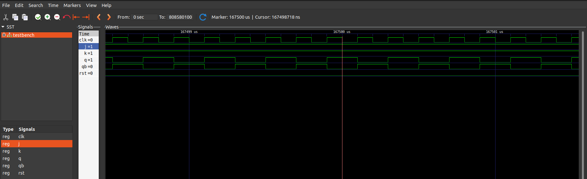

# JK Flip-Flop VHDL Implementation

This repository contains VHDL code for a JK flip-flop (`jk_flipflop`) and its corresponding testbench (`jk_flipflop_tb`). The JK flip-flop has two inputs, J and K, along with clock (`CLK`) and reset (`RESET`) inputs. It also features outputs `Q` and `Q_bar`.

## Files

- `jk_flipflop.vhdl`: VHDL code for the JK flip-flop entity and architecture.
- `jk_flipflop_tb.vhdl`: VHDL code for the testbench entity and architecture.

## `jk_flipflop` Entity

The `jk_flipflop` entity represents a JK flip-flop with the following ports:

- `J`: Input for setting the output.
- `K`: Input for resetting the output.
- `CLK`: Clock input.
- `RESET`: Asynchronous reset input.
- `Q`: Output representing the state of the flip-flop.
- `Q_bar`: Complementary output of `Q`.

## Behavior

The JK flip-flop captures the value of input `J` on the rising edge of the clock (`CLK`) and either sets or resets the output based on the inputs `J` and `K`. If the reset (`RESET`) signal is asserted (`'1'`), the flip-flop is asynchronously reset.

## Testbench (`jk_flipflop_tb`)

The testbench (`jk_flipflop_tb`) verifies the functionality of the `jk_flipflop` entity. It provides stimulus to the flip-flop inputs (`J`, `K`, `CLK`, `RESET`) and monitors the outputs (`Q`, `Q_bar`).

## Running the Testbench

To run the testbench:

1. Compile the VHDL files (`jk_flipflop.vhdl` and `jk_flipflop_tb.vhdl`) using a VHDL compiler (e.g., GHDL).
2. Simulate the compiled design using a simulator (e.g., GHDL or ModelSim).

## Screenshot

