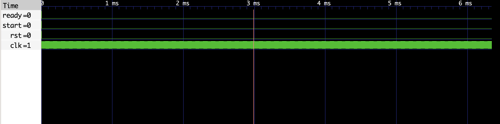

# Least Common Multiple Finite State Machine (FSM) VHDL Implementation

This repository contains VHDL code for a Least Common Multiple (LCM) computation using a Finite State Machine (FSM), along with its corresponding testbench (`lcm_fsm_tb`). The FSM computes the LCM of two input unsigned integers.

## Files

- `lcm_fsm.vhdl`: VHDL code for the LCM FSM entity and architecture.
- `lcm_fsm_tb.vhdl`: VHDL code for the testbench entity and architecture.

## `lcm_fsm` Entity

The `lcm_fsm` entity represents the LCM computation FSM with the following ports:

- `clk`: Clock signal input.
- `rst`: Reset signal input.
- `start`: Start signal input to initiate LCM computation.
- `ready`: Output indicating when the LCM computation is complete.
- `num1`, `num2`: Input unsigned integers for LCM computation.
- `lcm_result`: Output representing the computed LCM.

## Behavior

The FSM computes the LCM of the input unsigned integers `num1` and `num2`. It transitions through states `IDLE`, `INIT`, `COMPUTE`, and `DONE` as it performs the computation. When the LCM computation is complete, the `ready` signal is asserted, and the result is available in `lcm_result`.

## Testbench (`lcm_fsm_tb`)

The testbench (`lcm_fsm_tb`) verifies the functionality of the LCM FSM. It provides stimulus to the FSM inputs (`clk`, `rst`, `start`, `num1`, `num2`) and monitors the outputs (`ready`, `lcm_result`).

## Running the Testbench

To run the testbench:

1. Compile the VHDL files (`lcm_fsm.vhdl` and `lcm_fsm_tb.vhdl`) using a VHDL compiler (e.g., GHDL).
2. Simulate the compiled design using a simulator (e.g., GHDL or ModelSim).

## Screenshot

