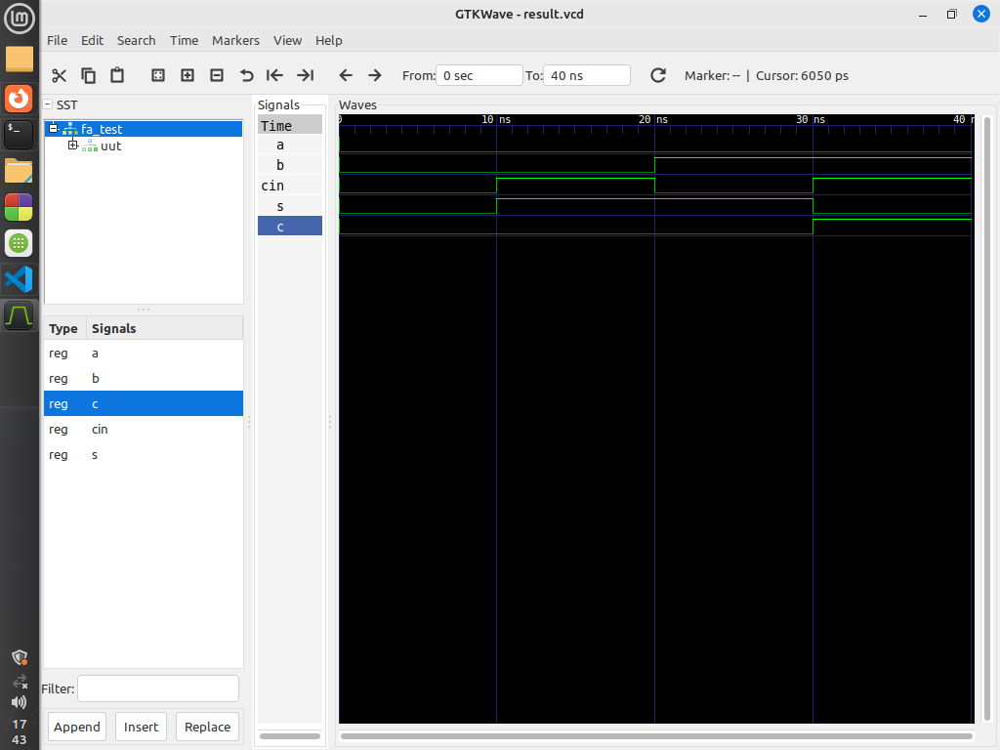

# Full Adder VHDL Implementation

This repository contains VHDL code for a full adder (`full_adder`) and its corresponding testbench (`full_adder_tb`). The full adder computes the sum of two input bits along with a carry-in bit (`Cin`), producing a sum output (`Sum`) and a carry-out (`Cout`).

## Files

- `full_adder.vhdl`: VHDL code for the full adder entity and architecture.
- `full_adder_tb.vhdl`: VHDL code for the testbench entity and architecture.

## `full_adder` Entity

The `full_adder` entity represents a full adder with the following ports:

- `A`, `B`: Input bits to be added.
- `Cin`: Carry-in bit.
- `Sum`: Output representing the sum of `A`, `B`, and `Cin`.
- `Cout`: Output representing the carry-out of the addition.

## Behavior

The full adder computes the sum output (`Sum`) using the XOR operation on the inputs `A`, `B`, and `Cin`. It calculates the carry-out (`Cout`) using the OR operation on various combinations of the inputs.

## Testbench (`full_adder_tb`)

The testbench (`full_adder_tb`) verifies the functionality of the `full_adder` entity. It provides stimulus to the full adder inputs (`A`, `B`, `Cin`) and monitors the outputs (`Sum`, `Cout`).

## Running the Testbench

To run the testbench:

1. Compile the VHDL files (`full_adder.vhdl` and `full_adder_tb.vhdl`) using a VHDL compiler (e.g., GHDL).
2. Simulate the compiled design using a simulator (e.g., GHDL or ModelSim).

## Screenshots 

