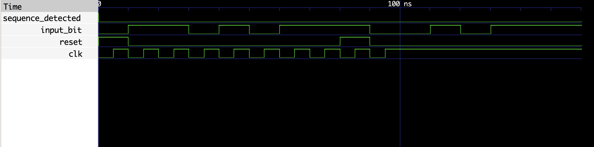

# Sequence Detector VHDL Implementation

This repository contains VHDL code for a sequence detector (`sequence_detector`) and its corresponding testbench (`sequence_detector_tb`). The sequence detector monitors a specific sequence of input bits and indicates when the sequence has been detected.

## Files

- `sequence_detector.vhdl`: VHDL code for the sequence detector entity and architecture.
- `sequence_detector_tb.vhdl`: VHDL code for the testbench entity and architecture.

## `sequence_detector` Entity

The `sequence_detector` entity represents a sequence detector with the following ports:

- `clk`: Clock signal input.
- `reset`: Reset signal input.
- `input_bit`: Input signal representing a single bit.
- `sequence_detected`: Output indicating when the specified sequence has been detected.

## Behavior

The sequence detector monitors the input bit sequence and transitions through different states (`IDLE`, `S1`, `S2`, `S3`, `DETECTED`) based on the observed pattern. It resets to the `IDLE` state upon receiving a reset signal (`reset = '1'`). When the specified sequence is detected, the `sequence_detected` output is asserted.

## Testbench (`sequence_detector_tb`)

The testbench (`sequence_detector_tb`) verifies the functionality of the `sequence_detector` entity. It provides stimulus to the sequence detector inputs (`clk`, `reset`, `input_bit`) and monitors the output (`sequence_detected`).

## Running the Testbench

To run the testbench:

1. Compile the VHDL files (`sequence_detector.vhdl` and `sequence_detector_tb.vhdl`) using a VHDL compiler (e.g., GHDL).
2. Simulate the compiled design using a simulator (e.g., GHDL or ModelSim).

## Screenshots

